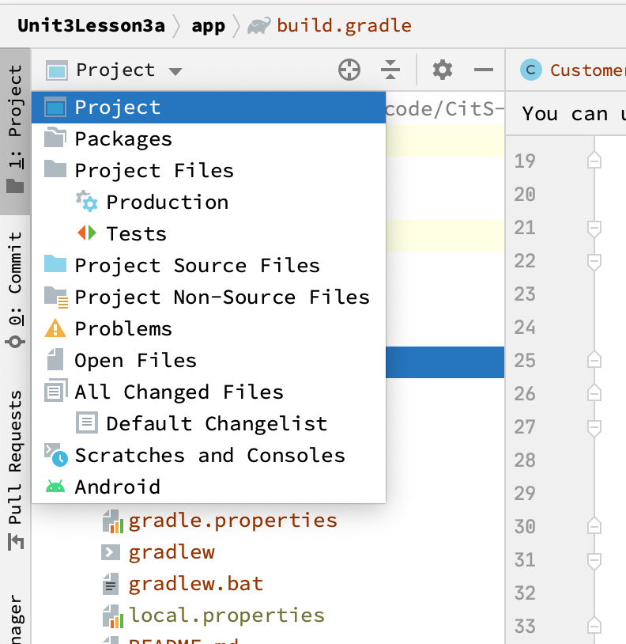
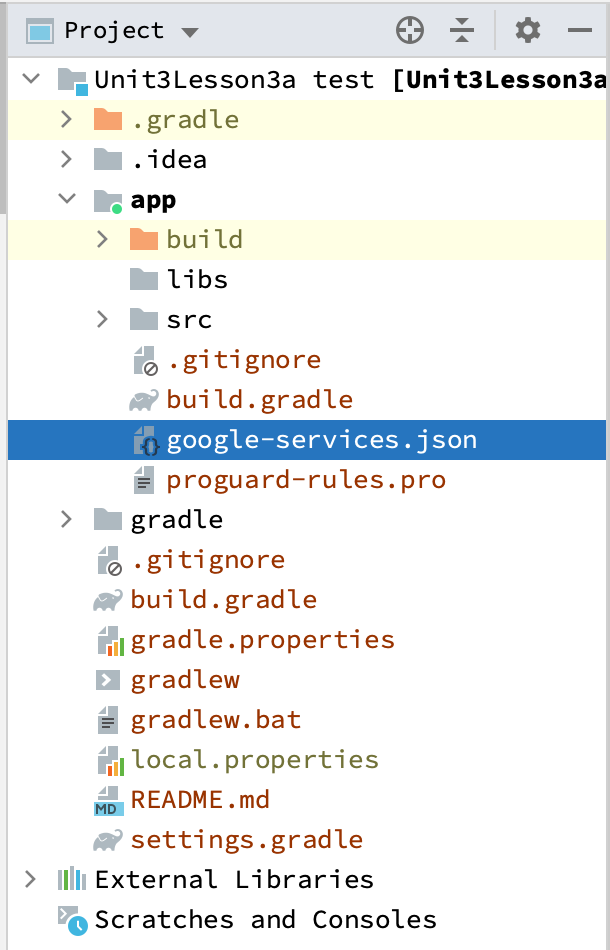
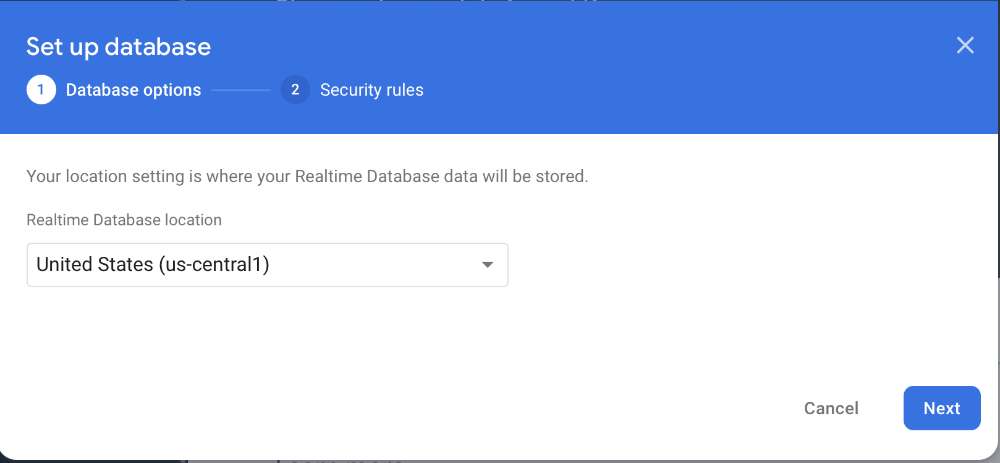
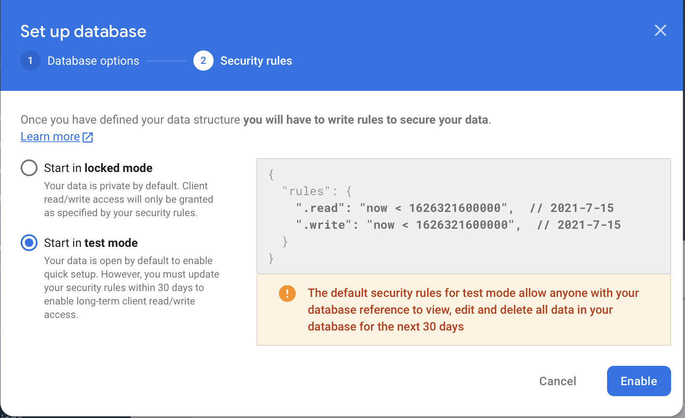
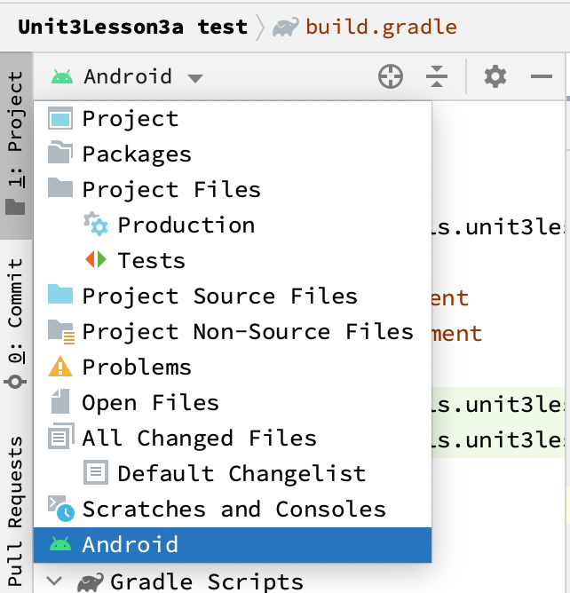
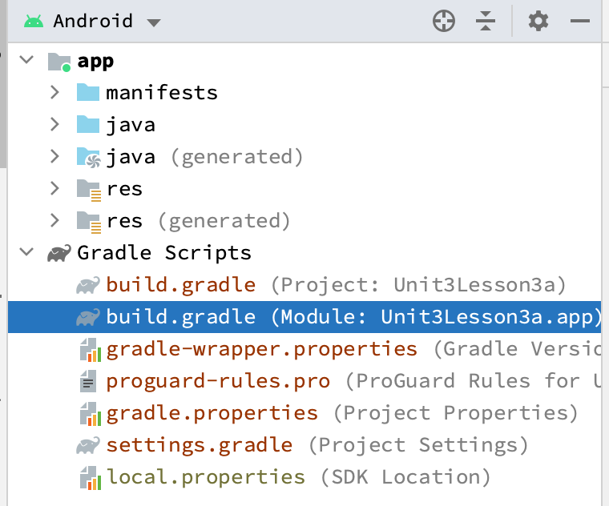
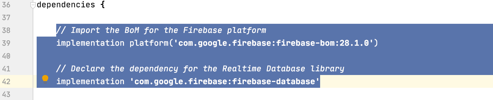
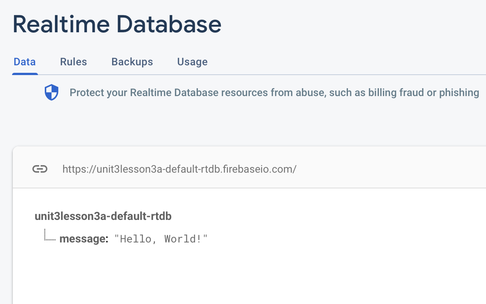
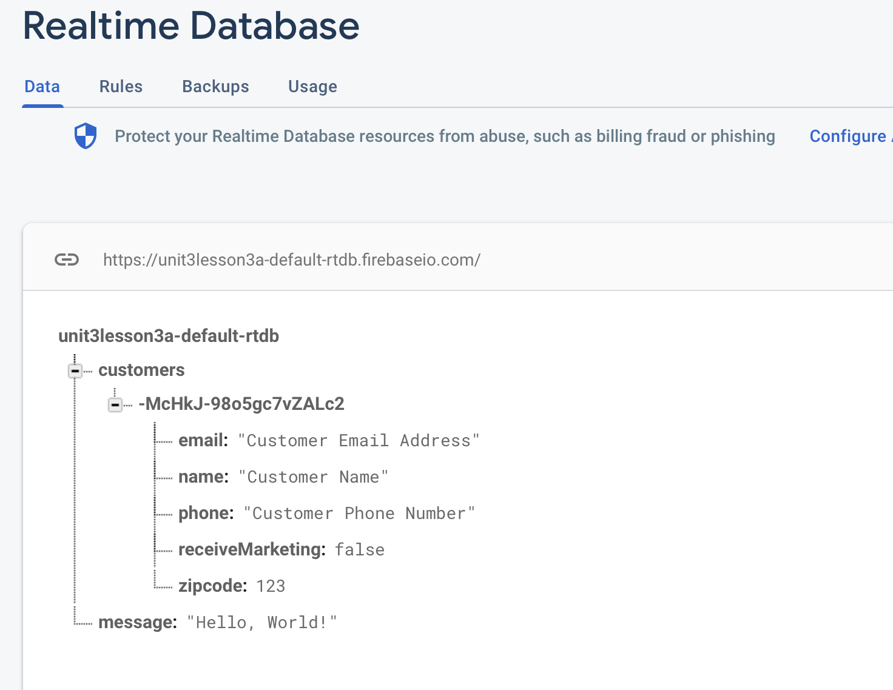
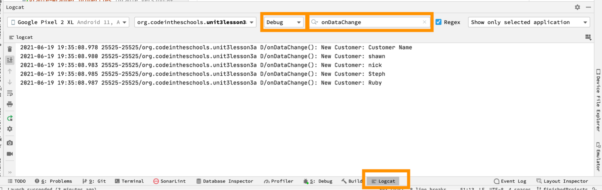

# Steps:

## Unit 3 Lesson3 Activity 2

1. Follow the guide [Add Firebase using the Firebase console](https://firebase.google.com/docs/android/setup?authuser=0#console) to setup Firebase for the application. A few notes:

    - Under “Step 1: Create a Firebase Project”, step 4 of “Create a Firebase project” mentions using Google Analytic. This is optional and not needed for any of the work we will do in this curriculum.
    - Under “Step 2: Register your app with Firebase”, step 3 asks for the **Android package name**, students should use the following package name when using the sample project in this lesson:
	`org.codeintheschools.unit3lesson3a`
    - Under “Step 3: Add a Firebase configuration file”, step 1, you need to ensure students change their view in Android Studio to the Projects view. Then they can drag and drop the google-services.json from their downloads folder into the apps folder.

        

        
    - Under “Step 3: Add a Firebase configuration file”, step 2 is completed for you in the sample project but it is important for students to find those lines and understand they have been added for them. They will NOT be added for them in future projects.
    - Similar to “Step 3: Add a Firebase configuration file”, step 2 … “Step 4: Add Firebase SDKs to your app” has been completed for you in the sample project but will not be there in future projects.
2. Students should confirm their app still builds but no new functionality should be noticeable yet.
3. We are now ready to move forward and begin working with Firebase Realtime Database in our project.


## Unit 3 Lesson 3 Activity 3

1. Navigate to the Realtime Database section of the [Firebase Console](https://console.firebase.google.com/project/_/database?authuser=0) and click the “Create Database” button.
2. Choose the geographic location for your Realtime Database, the default is most likely a fine choice, and click Next. With a high usage app, we would want to choose a region where most of our users will be. For now, we can use the default choice or change it to a region closest to you.
    
3. For Security rules, take time to review the two options but we are going to Start in test mode, and click “Enable”
    
4. After clicking Enable, our database has been created and is ready for use and you will be taken to the Realtime Database “Data” view. This view will eventually allow us to see and update data in your database.
5. Ensure students have returned their view in Android Studio to the Android view:
    
6. Under Gradle Scripts section of the explorer, open the build.grade (Module: Unit3Lesson3a.app) file.
    
7. Lines 38-42 load the Firebase platform and Realtime Database library. These have been added for convenience but students will need to know this step for their own projects. The directions provided in the Realtime Database [Installation & Setup on Android](https://firebase.google.com/docs/database/android/start?authuser=0) walk through these steps very clearly so students are encouraged to keep that page handy as a reference document.
    
8. Now, we will do a quick test to make sure everything is working.
9. Open the MainActivity class and add the following import statement (line 7 is a fine place to add it):

    ```java
    import com.google.firebase.database.*;

10. Insert the following code after `super.onCreate(savedInstanceState);`, about line 32:

    ```java
    //Makes a connection to the database
    FirebaseDatabase database = FirebaseDatabase.getInstance();

    //Gets a reference for an object at 'message'
    DatabaseReference myRef = database.getReference("message");

    //Writes a value at our
    myRef.setValue("Hello, World!");

11. Now run the app. You won't notice any difference when the app runs but if you check the Realtime Database Data view in the [Firebase Console](https://console.firebase.google.com/project/_/database?authuser=0), you should see a key/value pair of "message"/"Hello, World!".
    

12. After confirming this worked, remove lines you added in Step 3 in preparation for the next activity.

## Unit 3 Lesson3 Activity 4

1. Begin by creating a new class in the models folder called "Customer".
2. Above the line that reads `public class Customer {`, import the following library and add this annotation:

    ```java
    import com.google.firebase.database.IgnoreExtraProperties;

    @IgnoreExtraProperties
    public class Customer {

3. Inside the class, specify the following properties of our Customer objects:

    ```java
    public String name;
    public String email;
    public String phone;
    public int zipcode;
    public Boolean receiveMarketing;

4. Now we are going to add an empty constructor to our class. This is used by the Realtime database to try and map what it retrieves to our class. Just below the lines we added in step 3, add the following:

    ```java
    public Customer(){
        // Important!! This is needed for models that will be used with Firebase Realtime Database
        // Default constructor required for calls to DataSnapshot.getValue
    }

5. Finally, we will add a constructor that we can use to populate a Customer object. Just below the function we added in Step 4, add the following new code:

    ```java
    public Customer(String name, String email, String phone, int zipcode, Boolean receiveMarketing){
        this.name = name;
        this.email = email;
        this.phone = phone;
        this.zipcode = zipcode;
        this.receiveMarketing = receiveMarketing;
    }

6. Build your project and ensure it compiles. Troubleshoot any build issues before moving on to the next steps.

7. Open the AddCustomerFragment class. In this class, our goal is to add a new customer from the form into the database.
8. Above the line that reads `public class AddCustomerFragment extends Fragment {` import the firebase database library by adding the following line:

    ```java
    import com.google.firebase.database.*;

9. We are going to create a private variable to use to hold our connection to the database. After the line that reads `private AddCustomerBinding binding;`, add the following line:

    ```java
    private DatabaseReference mDatabase;

10. Next, we are going to connect to the database and store our connection in the variable we just created. In the function `public void onViewCreated(@NonNull View view, Bundle savedInstanceState) {` after the line that reads `super.onViewCreated(view, savedInstanceState);`, add the following lines:

    ```java
    //initiates database connection
        mDatabase = FirebaseDatabase.getInstance().getReference("customers");

11. This connects to our Firebase Realtime Database and gets a reference for an object named "customers". This would be the equivalent of connecting to a database server (the Realtime Database) and connecting to a specific database instance (customers). 

12. Now find the line that reads `binding.btnSave.setOnClickListener(new View.OnClickListener() {`, and inside there we will be working with the method `public void onClick(View view) {`.

13. First, we need to get the text that is stored in each of the EditText fields so update the function by adding this block of code just after `public void onClick(View view)`:

    ```java
    //Get each of the editText fields so we can reference their value later
    EditText newCustomerName = (EditText)getView().findViewById(R.id.editTextAddCustomerName);
    EditText newCustomerEmail = (EditText)getView().findViewById(R.id.editTextAddCustomerEmailAddress);
    EditText newCustomerPhone = (EditText)getView().findViewById(R.id.editTextAddCustomerPhone);
    EditText newCustomerZip = (EditText)getView().findViewById(R.id.editTextAddCustomerZipcode);
    CheckBox newCustomerSendMarketing = (CheckBox) getView().findViewById(R.id.checkBoxAddSendMarketing);

14. I recommend wrapping the upcoming code in a try/catch block in case the user enters invalid data in a field (e.g. text in the zipcode field). Add `try{` after the code in step 13 and then after the lines that read:

    ```java
    //Return to Customer View Fragment
    NavHostFragment.findNavController(AddCustomerFragment.this)
            .navigate(R.id.action_AddCustomerFragment_to_CustomerViewFragment);
    ```

    add:

    ```java
    }catch(Exception e) {
        //Show an error message at the bottom of the screen.
        Snackbar.make(view, "Error adding customer. " + e.getMessage(), Snackbar.LENGTH_LONG)
            .setAction("Action", null).show();
    }

15. As a check-in, ensure your app builds and you can double check against the code below:

    ```java
    //Adds an event listener to the Save button
    binding.btnSave.setOnClickListener(new View.OnClickListener() {
        @Override
        public void onClick(View view) {
            //Get each of the editText fields so we can reference their value later
            EditText newCustomerName = (EditText)getView().findViewById(R.id.editTextAddCustomerName);
            EditText newCustomerEmail = (EditText)getView().findViewById(R.id.editTextAddCustomerEmailAddress);
            EditText newCustomerPhone = (EditText)getView().findViewById(R.id.editTextAddCustomerPhone);
            EditText newCustomerZip = (EditText)getView().findViewById(R.id.editTextAddCustomerZipcode);
            CheckBox newCustomerSendMarketing = (CheckBox) getView().findViewById(R.id.checkBoxAddSendMarketing);

            try{
                //Return to Customer View Fragment
                NavHostFragment.findNavController(AddCustomerFragment.this)
                        .navigate(R.id.action_AddCustomerFragment_to_CustomerViewFragment);
            }catch(Exception e) {
                //Show an error message at the bottom of the screen.
                Snackbar.make(view, "Error adding customer. " + e.getMessage(), Snackbar.LENGTH_LONG)
                        .setAction("Action", null).show();
            }    
        }
    });

16. Next we are going to create a customer object based off the information in the EditText views. Directly after the line that reads `try{`, add the following:

    ```java
    //Try to create a new customer
    Customer newCustomer = new Customer(newCustomerName.getText().toString() ,
            newCustomerEmail.getText().toString(),
            newCustomerPhone.getText().toString(),
            Integer.parseInt(newCustomerZip.getText().toString()),
            newCustomerSendMarketing.isChecked());
    ```

    This code uses our constructor to create a Customer object named newCustomer. It gets the values from the UI values.

17. The Realtime database uses a tree like structure similar to JSON. Information is stored with key/value pairs but the values can be objects/branches themselves. Still, we need to come up with a key that we are going to use for our customer object. It is not recommended to use keys that might change (e.g. name, email, phone number, etc), instead, most best practices recommend using an autogenerated key. To do that with Firebase Realtime Database, we can use this oneliner to get a randomly generated key for an object in the customer database. Add this line directly after lines added in step 16:
    
    ```java
    //Get an automatically generated "key" for the customer
    String key = mDatabase.push().getKey();

18. Now that we have the key value, we can set it's value to our new customer. Directly after the lines added in step 17, add the following:

    ```java
    //Add the customer to the datbase with the newly generated key
    mDatabase.child(key).setValue(newCustomer);
    ```

    This will get the child object with the key we just generated and set its value to the newCustomer object.

19. Build and run the project. Click on the plus button and enter a sample new customer. Click **Save** and you should be returned to the First Fragment view. 

20. Check the Realtime Database Data view in the [Firebase Console](https://console.firebase.google.com/project/_/database?authuser=0), you should see an entry named customers, with a child object with a randomly generated key and then if you look beneath that, you should see your new customer.

21. Notice how you can edit the customer directly in the Realtime Database Data view by clicking on any of the fields. The Realtime Database Data view is very powerful and makes it easy to view and update data. This is commonly referred to as making changes "on the backend" versus in-app. 

    

## Unit 3 Lesson 3 Activity 5

1. Before continuing, students should make sure that they have at least 4 sample entries in their customer database.

2. Begin by opening the CustomerViewFragment class.

3. We are going to add an array that stores a list of customers retrieved from the database and a variable to track our location in the array. Find the line that reads `private CustomerViewBinding binding;` (Should be line 18 or near there) and add the following code directly below it:

    ```java
    private ArrayList<Customer> myCustomers;
    private int currentIndex;

4. Next, we will connect to the database and get a reference to the database that we can use to retrieve data. Directly below the line added in Step 4, add the following line:

    ```java
    DatabaseReference mDatabase = FirebaseDatabase.getInstance().getReference("customers");
    ```

    This line connects to our database and gets a reference to the "customers" object tree.

    NOTE: This doesn't actually return any values in the database for us. It creates a connection but no data is exchanged.

5. Android app developlment best practices do not want us to slow down any of the animations or other logic we may do with database queries, so all queries to the database happen in the background and we have to create different event listeners to react when transactions happen in the database. 

6. We are going to use a [ValueEventListener](https://firebase.google.com/docs/database/android/lists-of-data?authuser=0#listen_for_value_events) to get a list of all the customers in the database. A ValueEventListener will return the entire list of entries as a single DataSnapshot. Then we can loop over that result to access all the individual customers.

7. Add the following code below the line we added in Step 5 to create an ValueEventListener.

    ```java
    //Create a new listener that gets all of the Customers in a single call to the database
    ValueEventListener allCustomerQueryEventListener =
        new ValueEventListener() {
            @Override
            public void onDataChange(@NonNull @NotNull DataSnapshot snapshot) {
            }

            @Override
            public void onCancelled(@NonNull @NotNull DatabaseError error) {
            }
        };
    ```

    This is the template for an ValueEventListener.

8. Next, in the ValueEventListener method `onDataChange`, we are going to process all of the customer entries that come in. Add the following code just below the line that reads: `public void onDataChange(@NonNull @NotNull DataSnapshot snapshot) {` and make sure you read the comments and understand what the code is doing.

    ```java
    //Initialize our customer array
    myCustomers = new ArrayList<Customer>();

    // Iterate through all the children in the snapshot, this should be
    // all the children in the "customers" object
    for (DataSnapshot customerSnapShot : snapshot.getChildren()) {
        //From our snapshot, get the value of our key/value pair. This value
        //contains a customer object
        Customer myCustomer = customerSnapShot.getValue(Customer.class);

        Log.d("onDataChange()", "New Customer: " + myCustomer.name);
    }
    ```

9. Run the application in debug mode and use the logcat tool to see the log results. Set the logcat filter to `Debug`, `onDataChange` and you should see the customers in your database.
    

10. Instead of logging the customers, let's get them added to our array. Replace the line (or comment it out) `Log.d("onDataChange()", "New Customer: " + myCustomer.name);` with the following:

    ```java
    myCustomers.add(myCustomer);
    ```

11. That ValueEventListener will return all of the entries from the database any time any value is updated. 

12. So far, we've been able to read our customers from the database but we aren't displayng them yet. We will begin that in the next activity.

## Unit 3 Lesson 3 Activity 6

1. In this activity, we will begin populating the UI with our customers so we can see their information. 

2. Add the following code before the last `}` in the CustomerViewFragment class:

    ```java
    private void loadCustomerIntoView(Customer myCustomer) {
        //Get references for all of the views in this fragment
        EditText newCustomerName = (EditText) getView().findViewById(R.id.editTextTextCustomerName);
        EditText newCustomerEmail = (EditText) getView().findViewById(R.id.editTextCustomerEmail);
        EditText newCustomerPhone = (EditText) getView().findViewById(R.id.editTextCustomerPhone);
        EditText newCustomerZip = (EditText) getView().findViewById(R.id.editTextZipcode);
        CheckBox newCustomerSendMarketing =
                (CheckBox) getView().findViewById(R.id.checkBoxReceiveMarketing);

        //Set the values of the views based on the Customer object passed in to this method
        newCustomerName.setText(myCustomer.name);
        newCustomerEmail.setText(myCustomer.email);
        newCustomerPhone.setText(myCustomer.phone);
        newCustomerZip.setText(String.valueOf(myCustomer.zipcode));
        newCustomerSendMarketing.setChecked(myCustomer.receiveMarketing);
    }
    ```

3. This code will update our UI whenever we pass in a Customer object.

4. Now find our For loop from before:

    ```java
    // Iterate through all the children in the snapshot, this should be
    // all the children in the "customers" object
    for (DataSnapshot customerSnapShot : snapshot.getChildren()) {
        //From our snapshot, get the value of our key/value pair. This value
        //contains a customer object
        Customer myCustomer = customerSnapShot.getValue(Customer.class);

        //Log.d("onDataChange()", "New Customer: " + myCustomer.name);
        myCustomers.add(myCustomer);
    }
    ```

    After the ending curly brace `}`, add the following:

    ```java
    //Check if we have any customers
    if (myCustomers.size() > 0) {
        //Set the current index to 0, which is the first entry in the array
        currentIndex = 0;
        //Get the first customer
        Customer firstCustomer = myCustomers.get(currentIndex);
        //Load the first customer into the view with our new function
        loadCustomerIntoView(myCustomers.get(currentIndex));
    }
    //Check if we have more than 1 customer
    if (myCustomers.size() > 1) {
        //If we do, make the NEXT button visible so you can navigate to a different customer
        binding.buttonNext.setVisibility(View.VISIBLE);
    }
    ```

5. Run your application and verify it still compiles and runs. You should see your first customer in the UI and you should see the NEXT button is now visible (but NOT working yet).

6. Let's make the NEXT button work. Find the line that reads `mDatabase.addValueEventListener(allCustomerQueryEventListener);` and add the following code, make sure you read the comments and understand what the code does:

    ```java
    // Next Button
      binding.buttonNext.setOnClickListener(
          new View.OnClickListener() {
              @Override
              public void onClick(View view) {
                  //Add 1 to the currentIndex
                  currentIndex = currentIndex + 1;

                  //Get the next customer and load them in the view
                  loadCustomerIntoView(myCustomers.get(currentIndex));

                  //If this is the last customer, turn off the NEXT button
                  if (currentIndex == myCustomers.size() - 1) {
                      binding.buttonNext.setVisibility(View.INVISIBLE);
                  }

                  //If there are previous customers, enable the PREVIOUS button
                  if (currentIndex > 0) {
                      binding.buttonPrevious.setVisibility(View.VISIBLE);
                  }
              }
          });
    ```

7. Build and Run your app and confirm that the NEXT button works. You should also now see the PREVIOUS button (assuming you have more than one customer in your database) but it will not be working. Let's fix that next...

8. Right below the code we added in Step 6, add the following code:

    ```java
    // Previous Button
      binding.buttonPrevious.setOnClickListener(
          new View.OnClickListener() {
              @Override
              public void onClick(View view) {
                  //Subtract 1 from the currentIndex
                  currentIndex = currentIndex - 1;

                  //Get the previous customer and load them in the view
                  loadCustomerIntoView(myCustomers.get(currentIndex));
                  
                  //If this is the first item in the index, turn off the PREVIOIUS button
                  if (currentIndex == 0) {
                      binding.buttonPrevious.setVisibility(View.INVISIBLE);
                  }
                  
                  //If there are more customers in the index, turn on the NEXT button
                  if (currentIndex < myCustomers.size() - 1) {
                      binding.buttonNext.setVisibility(View.VISIBLE);
                  }
              }
          });
    ```

9. Build and run the project again and test moving between customer entries. You should be able to move to the end of the list and beginning of the list and see the corresponding buttons appear and disappear.

